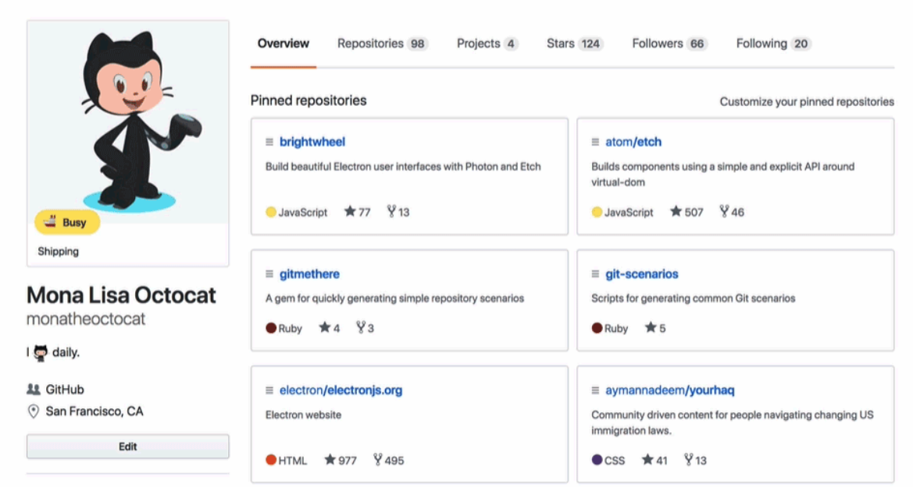
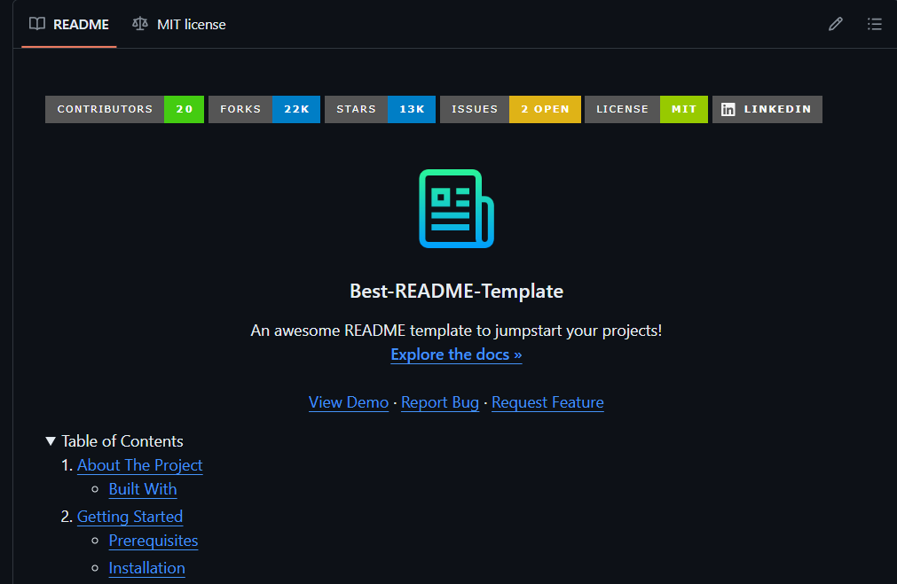

# Personalizando repositorios de Github

 

Cuando trabajas en un proyecto en GitHub, a menudo te encuentras con el
desafío de presentar tus trabajos de manera efectiva. 

Ya sea que estés desarrollando una aplicación, quieras mostrar 
los proyectos realizados durante un diplomado o en algún curso en línea (MOOC), 
es crucial saber cómo destacar tu trabajo de la mejor manera posible.

En este artículo, te guiaré a través de algunos métodos efectivos para mostrar
tus diversos repositorios según tus necesidades específicas.

> 🔑 **Nota**: Para seguir este tutorial, es necesario disponer de una [Cuenta en GitHub](https://docs.github.com/es/get-started/start-your-journey/creating-an-account-on-github). 
> Además, se recomienda actualizar tu foto de perfil y tu nombre de usuario.

## Sobre los repositorios de Github

Un repositorio en GitHub es un espacio donde se almacenan y gestionan 
los archivos de un proyecto de software utilizando el sistema de control de
versiones Git.

En términos simples, es como una carpeta o un directorio
en tu computadora donde guardas todos los archivos relacionados
con tu proyecto, pero alojado en la nube y accesible para ti y 
para otros colaboradores.

Además de ser un lugar para almacenar archivos, GitHub proporciona 
una serie de herramientas y funcionalidades que facilitan la colaboración 
entre desarrolladores.  

Estas incluyen seguimiento de problemas (issue tracking), 
solicitudes de extracción (pull requests), revisión de código (code review),
integración continua (continuous integration) y mucho más. 

Estas características hacen que GitHub sea una plataforma poderosa para el 
desarrollo de software en equipo y la colaboración en proyectos de código abierto.

## Sobre los `README.md`

Los archivos README.md son documentos de texto con 
formato Markdown que se encuentran comúnmente en los 
repositorios de GitHub y en otros sistemas de control de versiones. 

El nombre "README" proviene de "Read Me", que indica su propósito principal:
proporcionar información relevante sobre el proyecto para que los usuarios 
puedan leerlo rápidamente.

Los README.md suelen contener información importante sobre el 
proyecto, como una descripción general del mismo, instrucciones de instalación, 
ejemplos de uso, requisitos del sistema, créditos y cualquier otra información
relevante que los usuarios o colaboradores puedan necesitar.

Dado que el README.md es el primer documento 
que muchos visitantes de un repositorio verán, 
es importante redactarlo de manera clara y concisa
para que puedan comprender rápidamente de qué se trata el proyecto y
cómo pueden interactuar con él. Un README.md bien elaborado puede ser **crucial**.

## Creando un `README.md` a la medida

Para la creación del `README.md` dependerá del foco que queramos. Existen varios tipos de mostrar la informacion, por 
lo que desglosaremos esto en dos parate:

* para proyectos: describir paso a paso un proyecto completo
* para portafolio: para mostrar tus trabajos (clases, proyectos, etc)

### Para proyectos

### Para portafolio

## Conclusión

